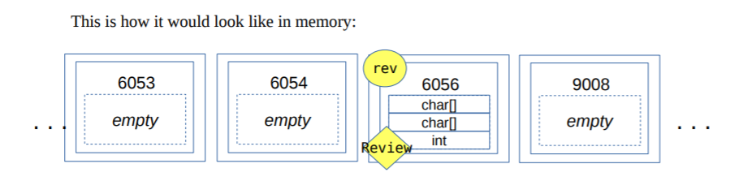
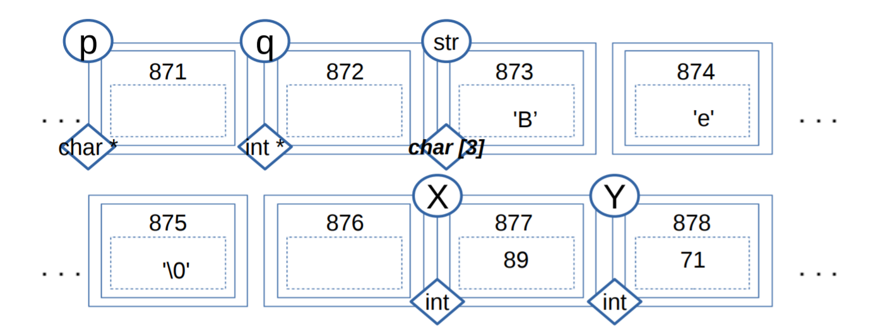

---
title:
- CSCA48 Tutorial 4 - CDTs, Quiz Review, Debugging
author:
- Tabeeb Yeamin, github.com/tabeebyeamin
theme:
- Copenhagen
date:
- February 6, 2020
---

# Agenda

+ Compound Data Types Review
+ Quiz Review
+ Debugging practice

# Compound data types
+ Why? because we need to represent information about entities
    that have multiple properties of interest
+ We don't want to have these different pieces of information
    floating around in separate arrays
+ We want to bundle/package all the information pertaining a
    single entity into a nice little package
+ Hence, compound data types - Bento boxes!


## Properties of the CDT
+ Everything is nicely separated, organized, in its own place
+ All components have to be there


# How to define CDTs in C

```c
typedef   struct  a_name_for_struct
{
    // Data!
}  new_type_name;
```

## How to use them?
+ Declare a variable: 
```c
new_type  v;
```
+ Access a field: 
```c
v.field_name = value;
```

+ Pass them or return them from a function:
```c
new_type  update_internal_values(new_type v,
int value1, ... , int valueN);
```

# In the memory model


+ A variable for a compound data type gets ONE chubby locker, inside
    that locker are all the components of the CDT
+ It's NOT an array!
+ But you can put an array inside a CDT
+ Passing a CDT variable to a function makes a copy!
+ Returning a CDT variable from a function also makes a copy!
+ Lots of data traffic this way, so we prefer using pointers

# Using pointers for structs

```c
typedef   struct  a_name_for_struct
{
   int field_name;
} new_type;
```

## Using pointers means

+ accessing fields with the -> operator
```c
new_type  v;
new_type  *vp;
vp=&v;
vp->field_name=value;
```

#
Quiz Review!

# Quiz Review

## 2(A). Which of the statements below is **not** true about data types in C?

**a.** `(int)` and `(double)` are compatible data types and we can convert one to the other

**b.**  `(char)` is compatible with `(int)` – we can print a char as an int and it won’t cause an error

**c.**  We can change the data type of a specific variable by type-casting it to a different type

**d.**  The compiler does type conversions automatically for compatible data types

**e.**  Data types tell the compiler how to interpret binary data in the computer’s memory

# Quiz Review

## 2(A). Which of the statements below is **not** true about data types in C?
**c.**  We can change the data type of a specific variable by type-casting it to a different type


# Quiz Review

## 1(A).- Which among the options below is not a property of boxes in the C memory model?

**a.** Boxes have a unique number to identify them

**b.** Empty boxes can have junk inside

**c.** Variable names are kept inside the box they are attached to

**d.** Boxes are reserved by the Operating System for use by our program when they are needed

**e.** Pointers get their own box in the memory model

# Quiz Review

## 1(A).- Which among the options below is not a property of boxes in the C memory model?
**c.** Variable names are kept inside the box they are attached to


# Quiz Review

## 2(A).- Which of the following data types can not be used as a counter in a for loop?

**a.** a char

**b.** an int

**c.** a double

**d.** a string

**e.** a pointer

# Quiz Review

## 2(A).- Which of the following data types can not be used as a counter in a for loop?

**d.** a string


# Quiz Review

## 2(C).- Which of the following steps is not part of the process of calling a function (including the work the function itself does)?

**a.** compiling the function’s code so it can run

**b.** reserving space and setting the values of the function’s input parameters

**c.** reserving space for the function’s local variables

**d.** updating the return value

**e.** releasing the memory reserved for the function

# Quiz Review

## 2(C).- Which of the following steps is not part of the process of calling a function (including the work the function itself does)?

**a.** compiling the function’s code so it can run


Functions need to reserve space for the input parameters & local variables. As well as the return value, and then release all of that memory once it is done. So compilation is not part of its responsibities.

# Quiz Review

## 1(D).- Which of the following C instructions does not reserve any boxes in the memory model?

**a.** int x,y,z;

**b.** for (i=0; i<10; i++);

**c.** void func(int x);

**d.** double *f=NULL;

**e.** int main(void);

# Quiz Review

## 1(D).- Which of the following C instructions does not reserve any boxes in the memory model?

**b.** for (i=0; i<10; i++);

Not a because regular variables that need boxes, c still needs space for input params, d is a pointer so it needs space and e, the main function needs space to return int.

# Quiz Review

## 2(D).- Which of the options below is not something we can do with arrays? (it won’t compile!)

**a.** declare and initialize an array in the same line

**b.** for an integer array, assign an element like this: array[0]=’A’;

**c.** copy one array into another using ‘=’, e.g. array2=array1;

**d.** use an index ‘i’ that is larger than the array

**e.** create and use a 2-dimensional array, e.g. array[x][y]=10;

# Quiz Review

## 2(D).- Which of the options below is not something we can do with arrays? (it won’t compile!)

**c.** copy one array into another using ‘=’, e.g. array2=array1;

We went over this in the 2nd tutorial in week3.

# Quiz Review
{ width=70% }

## 5(B).- What is the value of 'q' after q=&Y;?
**a.** 71 **b.** 872 **c.** 89 **d.** 878 **e.** 874

# Quiz Review
{ width=70% }

## 5(B).- What is the value of 'q' after q=&Y;?
**d.** 878

&Y means memory address of Y.

# Quiz Review
{ width=70% }

## 6(B).- Given that q=&Y, what instruction would change the 89 to 15?
**a.** q-1=15;  **b.** *(q)-1=15;  **c.** *(q)=15;  **d.** &str[3]=15; **e.** *(q-1)=15;

# Quiz Review
{ width=70% }

## 6(B).- Given that q=&Y, what instruction would change the 89 to 15?
**e.** *(q-1)=15;

Get the memory address before it and derefence it to assign the value.

# Quiz Review
{ width=70% }

## 7(B).- All the instructions below except for one refer to the same box in the memory model, which one doesn’t?
**a.** (&q)+1; **b.** *(q-5); **c.** &(str[0]); **d.** str[0]; **e.** (&(str[1]))-1;

# Quiz Review
{ width=70% }

## 7(B).- All the instructions below except for one refer to the same box in the memory model, which one doesn’t?
**d.** str[0];

str[0] evalutes to 'B'


# Quiz Review
{ width=70% }

## 8(B).- If we have p=&str[0]; what does the instruction `*(p)=*(p+2)`; do?
**a.** makes p point to str[2]           **b.** Makes the string empty

**c.** Moves the ‘B’ to another box        **d.** stores ‘p’ in str[0] 

**e.** Adds 2 to ‘B’, resulting in ‘D’

# Quiz Review
{ width=70% }

## 8(B).- If we have p=&str[0]; what does the instruction `*(p)=*(p+2)`; do?
**b.** Makes the string empty

Makes the value at the memory address equal to the delimiter.


# Quiz Review
## 10(A).- If we give function_B() a pointer to a variable from function_A(), can function_B() look at other variables from function_A()?

**a.** no

**b.** yes 

**c.** it’s complicated

# Quiz Review
## 10(A).- If we give function_B() a pointer to a variable from function_A(), can function_B() look at other variables from function_A()?

**b.** yes 

function_A is still in the callstack and hasn't freed any of it's memory. It's not private so it can be accessed while it is not freed.


# Quiz Review

## 10(B).- With pointers, it is possible for a function to update the value of multiple variables outside the function’s code

**a.** it’s complicated

**b.** yes

**c.** no

# Quiz Review

## 10(B).- With pointers, it is possible for a function to update the value of multiple variables outside the function’s code

**b.** yes

This is basically what happens when you pass variables by reference in the main() function.

# Debugging 

+ Run your code with a known input/known output
+ Review what each step of your algorithm is supposed to do
+ Tracing: what the expected value for the variables/data in the program should be at each step of the program (following the pseudocode for your algorithm exactly!)
+ DO THIS WITH PEN/PAPER! 
+ CHECK that each step is indeed doing what it is expected and the variables have the right values


# Exercise 3 (Pseudocode It!)
```c
wordSwapper()
```
+ Takes two pointers, one for an input string, and one for a different (we don't know what's in it, possibly junk) string.

+ The function updates the second (destination) string so that it contains the same words as the input string, but in reverse order (the last word appears first, and vice versa).

The original string is:

`silence .is a looking bird:the turning; edge, of life. e. e. Cummings`

Destination string after swapping:

`cummings e. e. life. of edge, turning; bird:the looking a .is silence`
