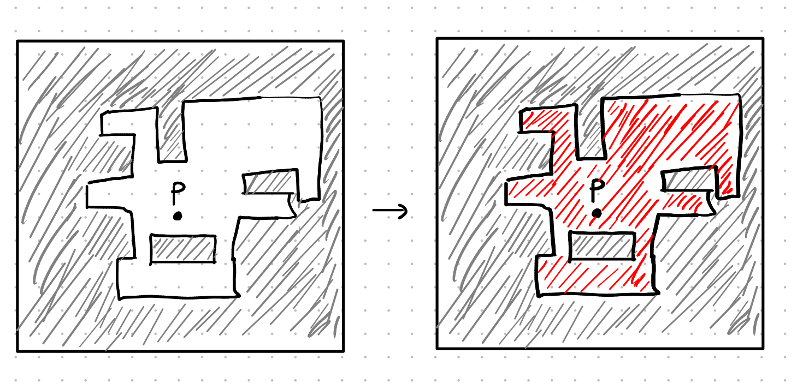

---
title:
- CSCA48 Tutorial 8 - BSTs and Flood fill
author:
- Tabeeb Yeamin, github.com/tabeebyeamin
theme:
- Copenhagen
date:
- March 12, 2020
---

# Agenda

+ BST
    - Insert
    - Delete
+ Flood Fill

# AMACSS Coffee House
- Coffee House is an AMACSS annual event 
- mix and mingle event for CMS students, staff and faculty 
to host a friendly environment for everyone to network 
- Wed March 18, 10:30AM-2:30PM @ EV Catalyst Center
- refreshments provided (baked goods, tea, coffee...)

# BST Insert Practice
+ Build a Binary Search Tree by inserting the following numbers in order:

```c
56, 17, 24, 78, 67, 98, 5, 2, 15, 31, 71
```

Compare with your neighbors!

# BST Delete Practice
+ Delete 56


# Flood Fill

+ Flood fill at point P, with value of "RED" and boundary "GREY"



# Flood Fill
+ Go to: `https://uoft.me/PacoFloodFill` and download the starter code
+ if you want a version that's easier to slightly easier to read: go
to my github and download the starter code in **t8/code**:
`https://github.com/tabeebyeamin/CSCA48W20/`

+ Implement the recursive function (floodFill_R)

+ Consider only the 4 neighbours up, down, left, and right - no diagonals.

+ Do it out on paper first!


# Recursion Tips
+ think like induction
+ start with your base case
+ think where you can put your recursive call
+ do it out on paper first

# Flood Fill
```c
void floodFill_R(char image[10][10],
int x, int y, char value, char bound) {
 // Base case: when at the bound or value, do nothing
  if (image[x][y] != bound && image[x][y] != value) {
      // assign the pixel to work with the base case
      image[x][y] = value;
      floodFill_R(_________________);
      floodFill_R(_________________);
      floodFill_R(_________________);
      floodFill_R(_________________);
  }
}

```